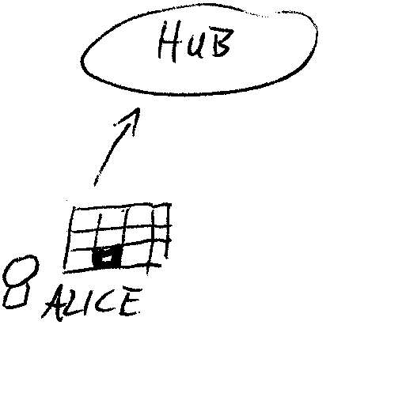
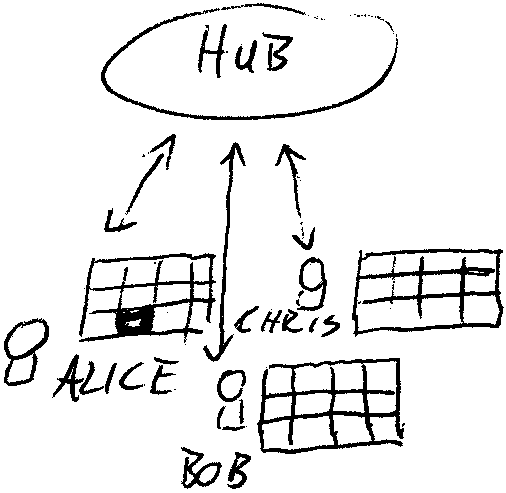
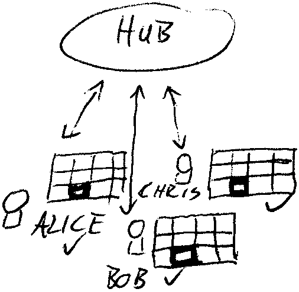
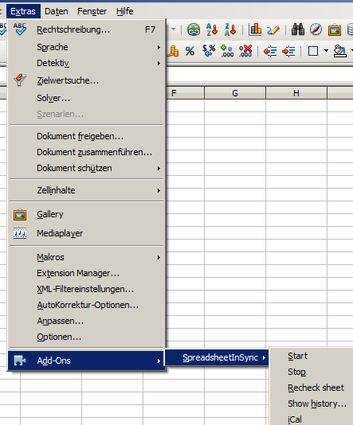
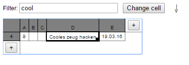

# SpreadsheetInSync
Real-time collaboration in/between two spreadsheet applications (OpenOffice.org Calc) plus web interface to work with the spreadsheet in your browser. Runs with CouchDB (or Cloudant). You keep working in the application you know, and you keep your files - but you have team sync in real time now! Essentially, the plugin synchronizes spreadsheets in real-time.

## What can you do with it?
The plugin (for OpenOffice.org Calc) allows parallel work on a spreadsheet with copies simultanously open on several computers. Whatever structure and setup you need to get the job done, you're free to do it!

With the plugin, everyone will see every change instantly and is always up to date. As you keep using files, you always have all the info with you - also to work offline and sync back when you have network connection. 

It's up to you whether to use the Cloud or your own network.

Here's some of what's in 4u: 
- you're free to create the structure you need, the sheet is yours - literally
- real offline capability: work offline and sync back later
- real real-time: changes sync instantly 
- works in both local network and the Cloud
- audit trail of each edit
- just go back to file w/out plugin at any time (no risk of locking yourself in)
- smart extras like iCal, Chat
- a Web view (runs in Desktop and mobile browsers)

You can use the plugin for things like:
- agile board / issue tracking
- organizing an event or conference
- managing timesheets, contracts and budgets
- info you need on the road
- hire shortlist / personal development plans
- communication plans
- brainstorming and shortlisting
- backlog / features / priorization for development
- purchasing and logistics
- leads you want to follow up on
- shift plans

and, off course: 
- your personal TODO list

(and certainly a lot more)

## How it works
Basically, there is a plugin extending the OpenOffice.org Calc that you have. The plugin listens for changes to cells and sends them up to a hub database. Either at once or when you re-connect and recheck/resync the sheet.

So here's the steps: 

 

Alice does some work in a spreadsheet which the plugin running. All changes are pushed up to a hub database (CouchDB).



Bob and Chris have their copy of the file open with the plugin running...



... which makes them get Alice's changes instantly - so everyone is up to date all the time.

## Installation and first steps

### OpenOffice.org Calc (OOo)
First of all, you need a [CouchDB](http://couchdb.apache.org) installation on your machine, your network or the Internet. You can use [Cloudant](http://cloudant.com) but be sure you understand their mechanics of charging - there's limits to what you get for free that also might change. Create a new and empty database in either case to hold your data.

Then, download 'SpreadsheetInSync.oxt' from [Releases](https://github.com/sebastianrothbucher/SpreadsheetInSync/releases) and double-click to install into the Extension Manager. For every spreadsheet file you create or open after that, you have a 'SpreadsheetInSync' menu below Tools > Add-ons (or Extras > Add-ons for e.g. the German localization). Here's how it looks like (w/ German OOo): 


Then, choose SpreadsheetInSync > Start. As it's the first time, it will prompt for the database details. Give server name (for Cloudant: 'yourname'.cloudant.com), port (standard for HTTP w/out SSL is 80, standard for HTTPS w/ SSL - the recommended way - is 443) and the name of the database you just created. 

Then (for the first time and any time you come back), it will prompt for username and passwort to CouchDB (for Cloudant it's per se the same credentials you log on to the website). When you run CouchDB in AdminParty w/out further protection (per se not recommended!), leave the password empty.

As soon as you have started, it will watch the database for any changes made by someone else. They will be inserted into the sheet and (for OOo) be marked by a yellow background color that disappears after a few seconds. Likewise, anything you type or change will be replicated up to the database. 

Rechecking the sheet is useful to make sure really all changes are uploaded.

Before closing the file, make sure to stop the replication.

## First replication

### Empty file, empty database
You'll be prompted for database details - and that's it ;-)

### Empty file, database with content
You'll be prompted for database details - and then receive all the content of the database into your file.

### File with content, empty database
You'll be prompted for database details - and you can then opt to push all changes "made offline" to the database. If you opt yes, you'll have both in sync. Depending on the size of the sheet, you might generate some traffic and it might take up some time.

## Working offline
Essentially, this is the generalization of the cases above: As soon as you start, you'll receive all changes pushed to the hub database while you were away. You'll then be prompted to upload all your changes since disconnecting. As you had the file in the meantime, everything is as usual. Conflicts are detected and you're promted for resolution, so you won't lose data.

## When you decide to throw out SpreadsheetInSync...
... which hopefully will never happen: you still have your files (the .xls/.xlsx/.ods files), so you can keep on working with them just like you did before, no harm done, no migration work necessary. 

## Web view
The Web view is a very simple spreadsheet you can open in the Browser: it runs on the hub database (served by CouchDB) and shows the contents you've uploaded there so far. You can also edit cells or filter for rows containing certain values. 

Here's a screen of the Web view:


Essentially, you can navigate around using the mouse or cursor keys, you can change a value and filter rows. On Webkit (Chrome / Safari), you can just type like you would do in OOo. 

### Installing directly
Once you have a hub database set up, you can install by cloning this repo, pointing your bash to the 'webview' subdirectory and running
```
./prereq.sh && ./install.sh <path2hubdb>
```

For instance (given server is couch.local and DB is mysheet)
```
./prereq.sh && ./install.sh 'http://couch.local:80/mysheet/'
```

This will download all libraries needed (happens only once) and then upload all that's necessary for the Web view via the following URL: 
```
http://couch.local:80/mysheet/_design/showfkt/_show/htmlout/webview
```
(There's also a menu item in OpenOffice.org Calc that gives you the Web view URL copy&paste-ready)

### Installing via install DB
To give users a somewhat more convenient way to install the Web view: create a database named 'webview_install' and install the Web view there as described above (don't actually use this DB as a hub DB). Then, choose SpreadsheetInSync > Webview > Install Webview from the menu

### Using a Login database
Standard HTTP login becomes unnerving, esp. on mobile phones. You can improve by using a login DB like described in [this Gist](https://gist.github.com/sebastianrothbucher/98615d0aa09eca5674f6#file-login-json)

Effectively, create yet another DB with public access (be sure you understand the implications of it all when being on the public Internet) and point your bookmark to that DB like this: 
```
http://couch.local:80/logindb_someext/_design/login/_show/login?redir?/mysheet/_design/showfkt/_show/htmlout/webview
```

## Advanced features

### History
The History feature shows you all edits made to a cell (in any application) along with who and when.

### iCal
This feature allows you to install an iCal stream to the Hub database. Essentially, you have to give two columns (for subject and date) and get a URL to paste into Google Calendar/Outlook/Thunderbird/etc.

### Chat
Opens a window where all OOo users can chat. Just enter your line at the bottom and see what others are writing.

### asana connect (experimental!)
It's a quite exprimental (and UI-wise also not very elaborate) feature. Give columns for subject, notes, due date, id, etc. and get all asana tasks (with a certain tag) synced in. Other than CSV import, updates are rather convenient. 

It needs an API key of asana and stores it into your user profile folder. If you get queasy about having such a key around: generate a new one in asana (which voids the saved/old one).

## Known limitations / things 2 keep in mind
(although you're using it at your own risk anyway; please also read through the LICENSE for all details)
- requires a recheck of the sheet after inserting / deleting rows or colums
- generally, a regular recheck of the sheet makes sense
- currenly uses the WinHttp COM libraries - hence runs on Windows systems only
- continuously issues requests to the CouchDB to stay updated (OOo version: periodically) - these might be charged depending on your plan
- likewise: initial share (and recheck) might produce a significant amount of requests to the CouchDB (at least one per cell, possibly several)
- at least the OOo version is not reliable with more than one sheet at a time
- binaries have been scanned with an up-to-date Antivirus software - please do recheck anyway before running
- when checking SSL on/off, the port won't adjust automatically (unless you have other info: it's likely 80 for HTTP and 443 for HTTPS)
- build is currently manual
- Times displayed in the history might not be timezone-adjusted correctly yet
- When syncing into unformatted cells, the format might be the (unexpected) default. For instance, dates might show as numbers (which you can change by changing the cell format).
- Time zones in History might not be correct
- iCal goes for date only (0am)
- asana connect does only read at the moment (and might suffer from API keys being discontinued)
- because of significant shortcomings, the Excel version was dropped, the focus is on OOo only

### for Web view specifically
- changed formula results might only show up after recheck of the sheet
- Web view edits without updating an actual Spreadsheet file will never result in formula changes
- any edit in the Web view are texts, so formulas might pick up your changes only after converting to numbers
- Web view just displays the first sheet available - yet without the ability to change that
- continuously issues requests to the CouchDB to stay updated (Webview: longpoll) - these might be charged depending on your plan
- Installing the Web view via menu is only possible if you create an installation DB on your own system. Otherwise, you can install via install.sh directly
- columns that have lots of long text might grow disproportionally large
- filtering does not span several cells of a row
- filtering can not contain comparison operators or be limited to certain cols
- there might not always be feedback on success of a change
- when using a separate DB to manage login to a sheet (useful e.g. for mobile), this URL is not shown via menu

## Developing
With a hugely proprietary dev env, it's best to download the binaries and start developing from there (before exporting the sources and checking them in).

## License
all code is licensed under: Apache License 2.0 (see LICENSE)

